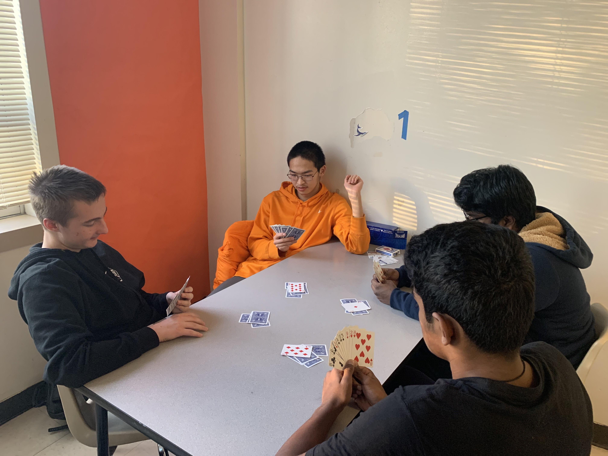

## [Home](./index.html) | [Play Bridge](./play.html) | [How to Play Bridge](./learn.html) | [Blog](./blog.html)

# 12/12/2022-Bridge the most complex game in the world

Hello and welcome to our Bridge club!

As a member of the club, I have to say that playing Bridge is an absolute blast. It's a game that's fun, challenging, and rewarding, and there's always something new to learn and enjoy.

One of the best things about our club is that we have players of all skill levels, from beginners who are just learning the game to experienced players who have been playing for years. It's a great way to improve your skills and meet new people who share your passion for the game.

As a more experienced player, I've had the opportunity to teach the game to some of our newer members. It's been really rewarding to see them progress and improve, and it's always fun to share my love of the game with others.

It's a game that will challenge and entertain you for hours on end. If you're interested, we invite you to come and join us as we delve into the complex world of Bridge, a game that can be played with just a single deck of cards.
